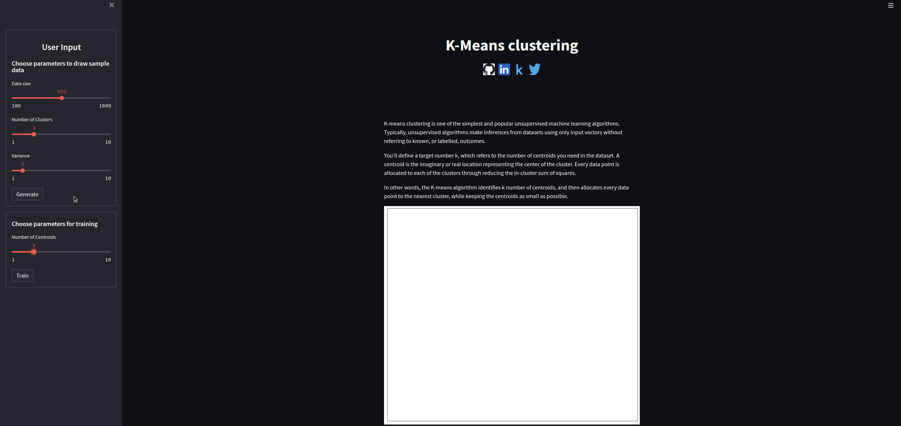

# k-means-visualize

In this repo I've implemented a simulation for k-means clustering. <br>
It's written from scratch so it will help you become familiar with this simple algorithm.

Here is the [web app](https://share.streamlit.io/rraphaell/k_means_visualization/main/kmeans_visualization.py)




## Running locally
### use conda env(recommended)
- using environment.yml
```
conda env create -f environment.yml
conda activate k_means_env
streamlit run kmeans_visualization.py
```

- using requirements.txt
```
conda create --name env_name python==3.8
conda activate env_name
conda install --file requirements.txt
streamlit run kmeans_visualization.py
```
